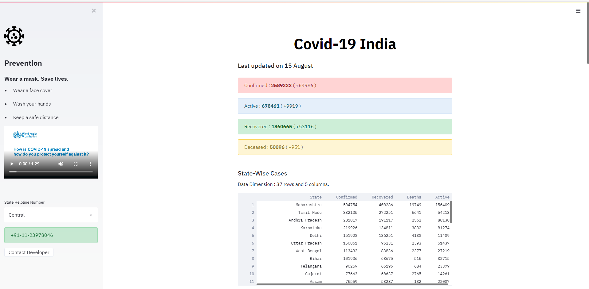
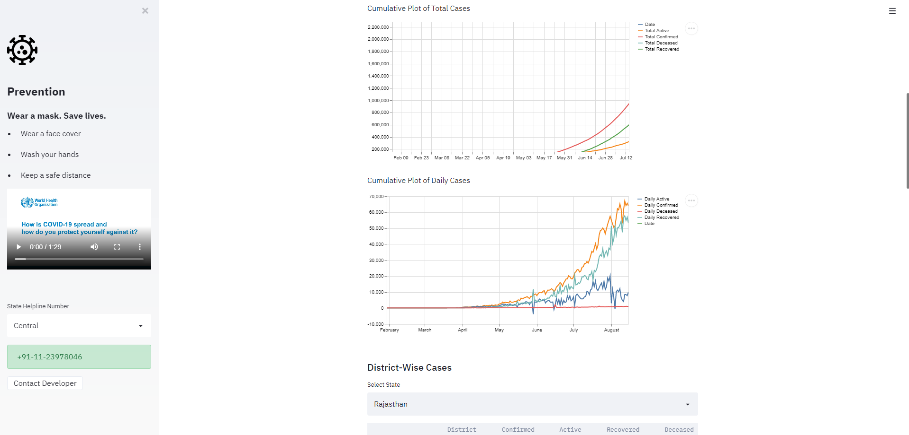
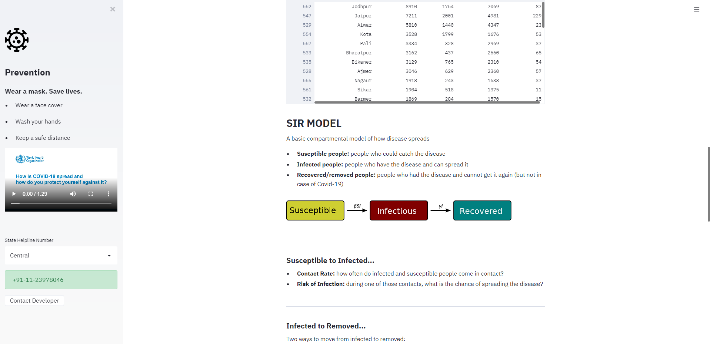
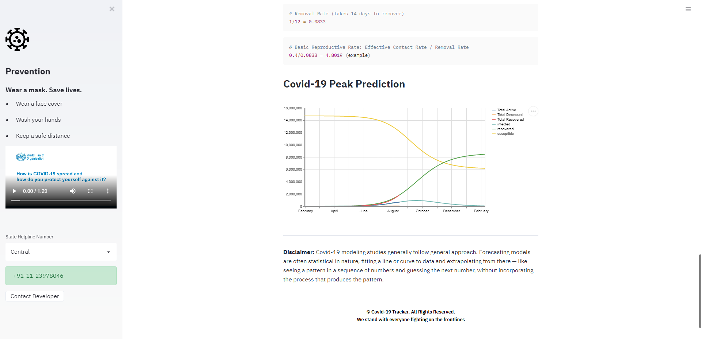

## Covid-19-India-Tracker 
   
- This is a Covid-19 Web App which displays information of covid-19 cases in India
- Shows total/daily Confirmed, Active, Recovered and Deaths
- State-wise and District-wise Cases
- State Helpline Numbers
- Covid-19 India Peak Prediction (SIR Model)

Link to deployed web app : _https://covid-19-india-tracker-pred.herokuapp.com/_

--- 

#### To setup the project on your local machine
1. Click on `Fork`.
2. Go to your fork and either `clone` or `download` the project to your local machine.
3. Install all the dependencies mentioned in `requirements.txt` file.
4. Open console in same folder as project and type `streamlit run 'COVID-19 INDIA.py'`

---
Please do ⭐ the repository, if it helped you in anyway.    
A glimpse of the web app:

